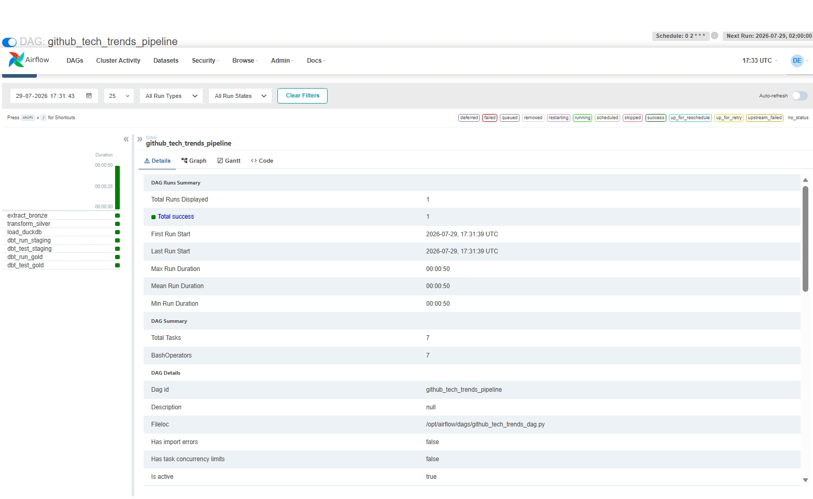

# 🚀 GitHub Tech Trends Data Pipeline

An end-to-end automated data engineering pipeline that ingests, cleans, models, and visualizes real-time tech stack popularity and repository activity metrics from GitHub.

## 🧰 Tech Stack

* **Language:** Python 3.10+
* **Orchestration:** Apache Airflow
* **Data Processing:** Pandas \& DuckDB
* **Visualization:** Streamlit \& Plotly
* **CI/CD:** GitHub Actions

## ⚡ Quick Start

`ash
python -m venv venv
.\\venv\\Scripts\\activate
pip install -r requirements.txt
streamlit run dashboard.py
``n

## 👤 Author

* **Rohit Gupta** - [rohitgupta-de](https://github.com/rohitgupta-de)

## ⚙️ Airflow Pipeline Architecture

The pipeline orchestrates API ingestion, schema validation, DuckDB transformations, and metric aggregations across a multi-stage DAG with automated retry logic and exception callbacks.

